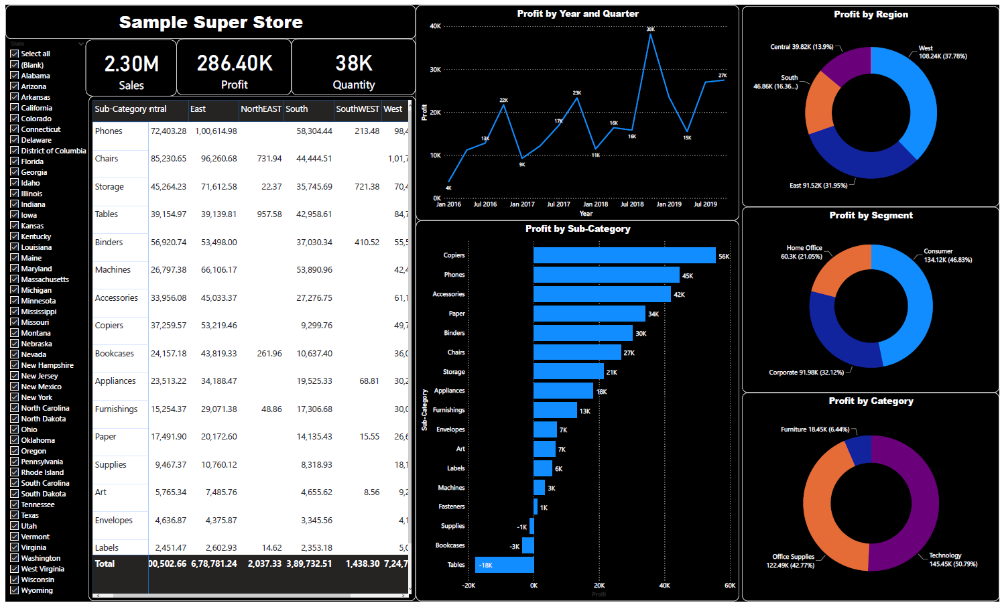

# Sample Super Store Dashboard

This project is a part of the personal Business Intelligence Projects

#### -- Project Status: [Completed]

## Project Intro/Objective
The purpose of this project is ________. (Create A dashboard for sales analysis of a store)

### Methods Used
* Data Analysis
* ETL
* Created Calculated columns and KPIs
* Final power bi report creation in Power BI

### Technologies
* Power Bi 

## Project Description
(Provide more detailed overview of the project.  Talk a bit about your data sources and what questions and hypothesis you are exploring. What specific data analysis/visualization and modelling work are you using to solve the problem? What blockers and challenges are you facing?  Feel free to number or bullet point things here)

## Getting Started

1. Raw Data is being kept [here](https://github.com/Muhliscm/dsProjects/tree/main/20210909-Sample%20superstore/data) within this repo.

.
## Featured Notebooks/Analysis/Deliverables
* [Power BI File](https://github.com/Muhliscm/dsProjects/blob/main/20210909-Sample%20superstore/Sample%20Super%20Store.pbix)
* [Final Report Pdf](https://github.com/Muhliscm/dsProjects/blob/main/20210909-Sample%20superstore/Sample%20Super%20Store-%20report.pdf)

