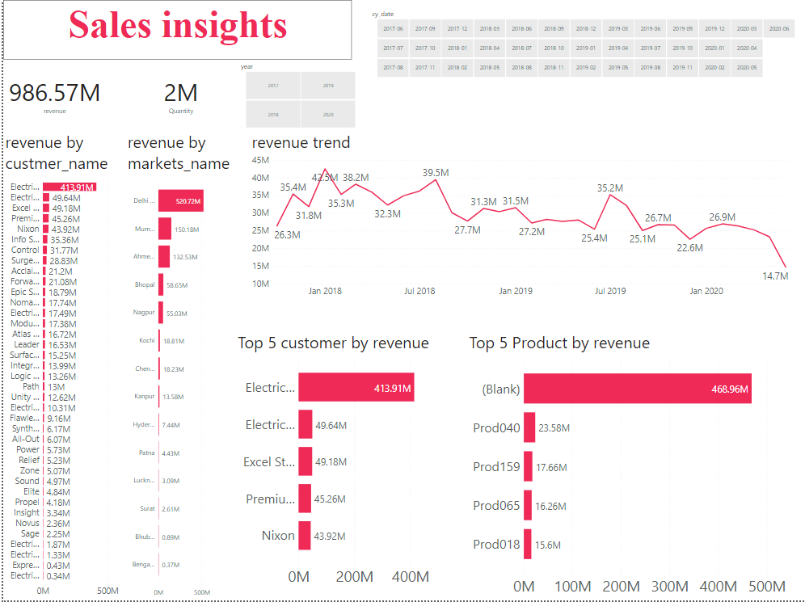

# Hardware Sales Analysis

This project is a part of the personal Business Intelligence Projects

#### -- Project Status: [Completed]

## Project Intro/Objective
The purpose of this project is to find the states and region where sales of product dicreased

### Methods Used
* Data collected as sql dump file from data science community 
* Uploaded to MySQL database
* First step analysis is done using MySQL
* ETL implemented using Power BI
* Second phase analysis is done using Power BI
* Created calculated columns and KPIs
* Final dashboard report created using Power BI

### Technologies
* Power Bi 
* MySQL

## Project Description
This project is intented to create a analysis dashboard to find the regions where sales of computer hardwares dicreased. The data collected from data science community as sql
dump file. This data is collected from data science community. The compony name is Atliq hardware who are distributor of hardware components in India

## Getting Started

1. Raw Data is being kept [here](https://github.com/Muhliscm/dsProjects/tree/main/20210920-Sales%20Analysis/data) within this repo.

.
## Featured Notebooks/Analysis/Deliverables
* [Power BI File](https://github.com/Muhliscm/dsProjects/blob/main/20210920-Sales%20Analysis/sales%20insights.pbix)
* [Final Report Pdf](https://github.com/Muhliscm/dsProjects/blob/main/20210920-Sales%20Analysis/sales%20insights.pdf)

