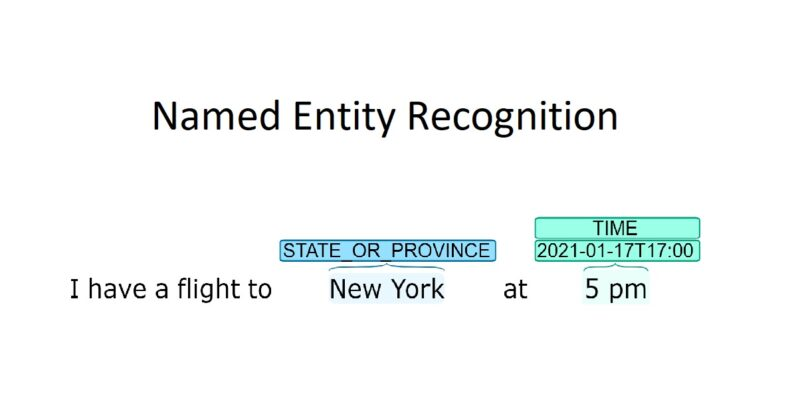

<h1 align="center"> Entity Extraction Using Transformers</h1>

 

 

<h2> :floppy_disk: Table of Content</h2>

 
  * [Introduction](#Introduction)
  * [Problem Statement](#Problem-Statement)
  * [Data Summary](#Data-Summary)
  * [Steps Involved](#Steps-Involved)
  * [Pre-processing](#Pre-processing)
  * [Algorithms used](#Algorithms-used)
  * [Conclusion](#Conclusion)

<h2> 📄 Introduction</h2>
Named entity recognition (NER) is a natural language processing (NLP) method that extracts and categorizes information from text. 
It's a subtask of information extraction that identifies and classifies named entities into predefined categories

<h2> ❓ Problem Statement</h2>

Extract some specific information from unstructured data and classify into different categories

<h2> :book: Data Summary </h2>
- conll2003 from Hugging face datasets
- The training data contained 14041 rows
- Test data has 3453 rows
- Validation data has 3250 rows

The dataset contains the following information:

* **Tokens**	
* **NER Tags**
  - B - Beginning of a tag
  - I - Inside of a tag
    
  - O - Others
  - B-PER - Person tag
  - I-PER - 
  - B-ORG - Organisation
  - I -ORG
  - B-LOC - Location
  - I-LOC
  - B-MISC - Miscellanius
  - I-MISC

<h2> 📑 Steps involved </h2>

1. Exploring the data: Analyzing the features and target variable

2. Encoding target tags using label encoding
   
4. Text Preprocessing for BERT

5. Train test split

6. Use BERT for fine-tuning and prediction

<h2>🛠️ Pre-processing </h2>

 

 

 

<h2>Getting Started</h2>

1.[Machine learning model building scripts](https://github.com/Muhliscm/dsProjects/blob/main/NER/NER.ipynb) 

<h2>💻 Algorithms used</h2>

* BERT Cased - from Hugging face Transformers

<h2> :bulb: Conclusion</h2>

* overall_precision =  0.8762853470437018
* overall_recall =  0.9178727701110737
* overall_f1 0.8965970738122636
* overall_accuracy : 0.9791899687996704

* Final Metrics

{'LOC': {'precision': 0.9180503481521157,
  'recall': 0.9330430048992924,
  'f1': 0.9254859611231101,
  'number': 1837},
 'MISC': {'precision': 0.7160377358490566,
  'recall': 0.8232104121475055,
  'f1': 0.7658930373360242,
  'number': 922},
 'ORG': {'precision': 0.8583877995642701,
  'recall': 0.8814317673378076,
  'f1': 0.8697571743929359,
  'number': 1341},
 'PER': {'precision': 0.9369791666666667,
  'recall': 0.9766558089033659,
  'f1': 0.9564061669324827,
  'number': 1842},
 'overall_precision': 0.8762853470437018,
 'overall_recall': 0.9178727701110737,
 'overall_f1': 0.8965970738122636,
 'overall_accuracy': 0.9791899687996704}
 

<!-- CREDITS -->
<h2 id="credits"> :scroll: Credits</h2>

MUHLIS CM | Data Scientist | Machine Learning Engineer 

 <i> Contact me for Data Science Project Collaborations</i>

