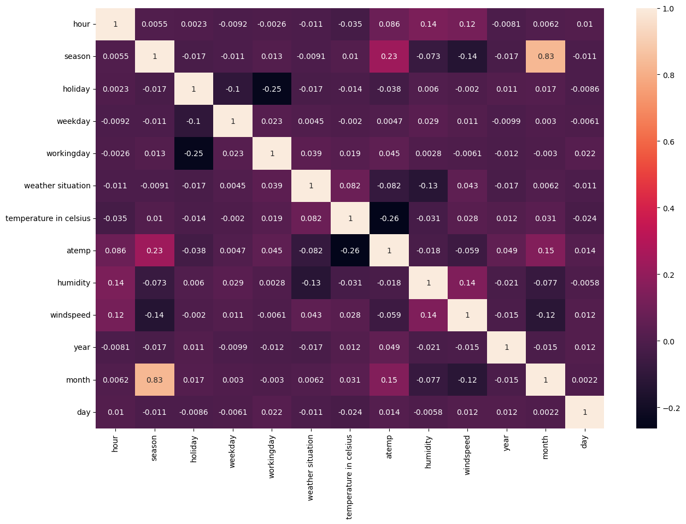
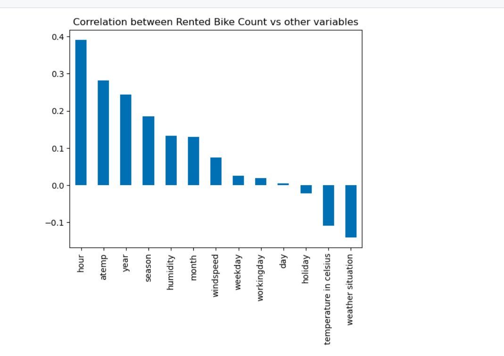
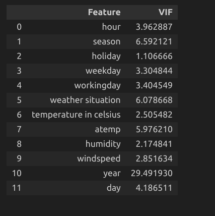
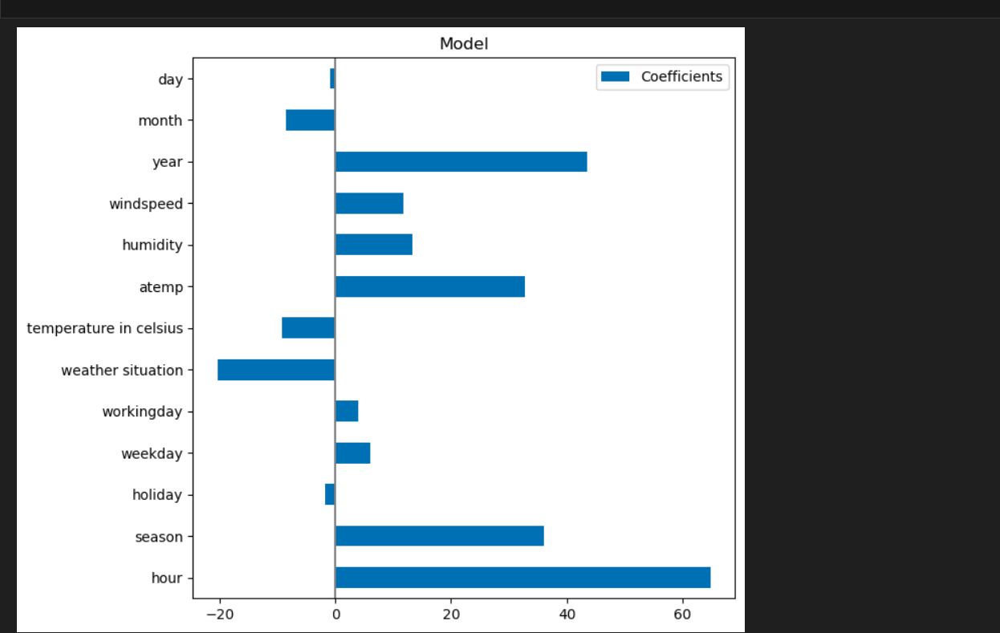
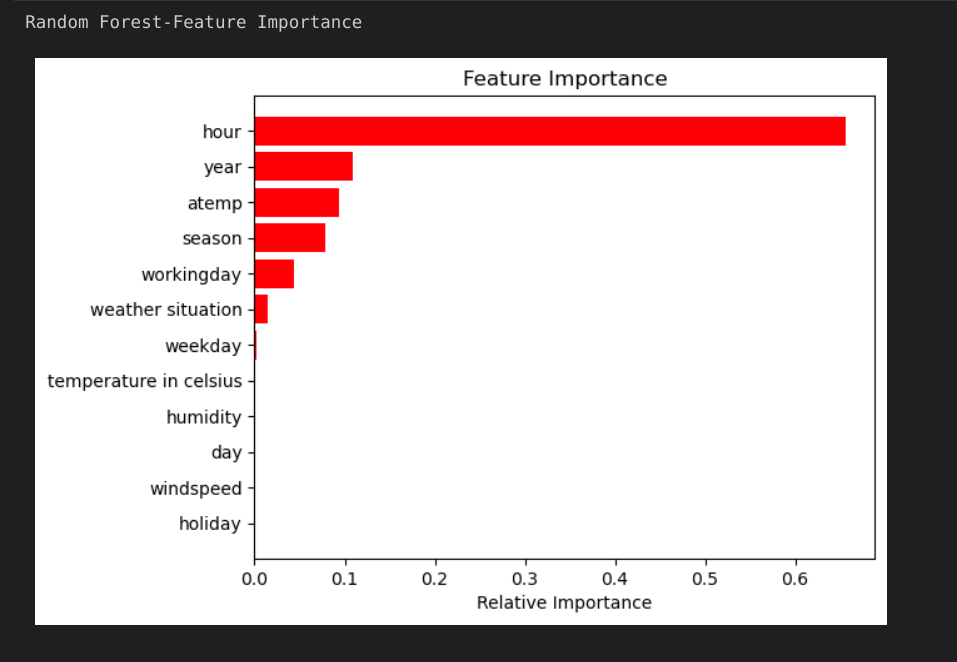

<h1 align="center"> Bicycle Demand Predictions</h1>

 

 

<h2> :floppy_disk: Table of Content</h2>

 
  * [Introduction](#Introduction)
  * [Problem Statement](#Problem-Statement)
  * [Objectives](#Objectives)
  * [Data Summary](#Data-Summary)
  * [Steps Involved](#Steps-Involved)
  * [Pre-processing](#Pre-processing)
  * [Algorithms used](#Algorithms-used)
  * [Conclusion](#Conclusion)

<h2> 📄 Introduction</h2>
Bike-sharing systems are a means of renting bicycles where the process of obtaining membership, rental, and bike return is automated via a network of kiosk locations throughout a city. Using these systems, people can rent a bike from one location and return it to a different place on an as-needed basis. Currently, there are over 500 bike-sharing programs around the world.

This project is a part of Kaggle bike demand prediction: https://www.kaggle.com/competitions/copy-of-sw5-mi-e23-bike-sharing

<h2> ❓ Problem Statement</h2>

Bicycle demand prediction refers to the task of forecasting the future demand for bicycles in a specific area or for a particular period. It involves using historical data and various factors or features that can influence bicycle usage to make predictions about how many bicycles will be needed or rented in the future. This prediction can be valuable for various purposes, such as urban planning, transportation management, bike-sharing system optimization, and more.

<h2> 🎯 Objectives: </h2>

1. Make predictions about how many bicycles will be needed or rented in the future

2. Using historical data and various factors or features that can influence bicycle usage

<h2> :book: Data Summary </h2>

The training data contained 10,000 user details who used the service of the Capital Bikeshare program in Washington, D.C.
Test data has 7379 user details

The dataset contains the following information:

* **Id**	
* **datetime** - date
* **yr**	- 0 for 2011, 1 for 2012
* **mnth**	- month - 1-12
* **hr**	- hour -0-23
* **season**	- 1 = spring, 2 = summer, 3 = fall, 4 = winter
* **holiday**	- whether the day is considered a holiday
* **weekday**	- whether the day is neither a weekend nor a holiday
* **workingday**
* **weathersit** 
  weather -
  1: Clear, Few clouds, Partly cloudy, Partly cloudy
  2: Mist + Cloudy, Mist + Broken clouds, Mist + Few clouds, Mist
  3: Light Snow, Light Rain + Thunderstorm + Scattered clouds, Light Rain + Scattered clouds
  4: Heavy Rain + Ice Pallets + Thunderstorm + Mist, Snow + Fog
* **temp**	 - temperature in Celsius
* **atemp**	- "feels like" temperature in Celsius
* **hum**	- relative humidity
* **windspeed**	
* **count** - number of total rentals (Feature to be predicted)

<h2> 📑 Steps involved </h2>

1. Exploring the data: Analyzing the features and target variable, checking for null values and duplicates, plotting the distribution of target variable, etc.

2. Treating numerical and categorical features separately, Encoding, etc.

3. Train test split, Transformation, Scaling, Future Selection etc.

4. Develop different models and evaluate them, Fine Tuning

<h2>🛠️ Pre-processing </h2>

In this project, the dependent variable is the ‘number of total rented bike count’, the prediction of which gives us how many bicycles will be needed or rented in the future
### Correlation Matrix

### Correlation of Target With other variables

### VIF

### Linear Regression Feature Importance

### Random Forest Regression Feature Importance

<h2>Getting Started</h2>

1.[RawData](https://github.com/Muhliscm/dsProjects/tree/main/bike-sharing-kaggle/data)  
2.[Exploratory Data Analysis scripts](https://github.com/Muhliscm/dsProjects/blob/main/bike-sharing-kaggle/EDA.ipynb) 
3.[Machine learning model building scripts](https://github.com/Muhliscm/dsProjects/blob/main/bike-sharing-kaggle/Feature_engineering.ipynb) 

<h2>💻 Algorithms used</h2>

* Linear Regression

* Random Forest Regression

<h3> Best Hyper-parameters </h3>

* Random Forest Regression:

 'n_estimators': 50  
 'min_samples_split': 150 
 'min_samples_leaf': 50 
 'max_depth': 8 
  
<h2> :bulb: Conclusion</h2>

This project focuses on how many bicycles will be needed or rented in the future

* In eda we found that Data is not linear. So linear regression gives a very poor score. So we used no linear models  
 
* We Chose random forest regression as the best model for further improvements based on recall

* Among all these models random forest regression gives us a r2 score of 0.78

*  Companies can use this prediction for their bike-sharing system optimization
 

<!-- CREDITS -->
<h2 id="credits"> :scroll: Credits</h2>

MUHLIS CM | Data Scientist | Machine Learning Engineer 

 <i> Contact me for Data Science Project Collaborations</i>

