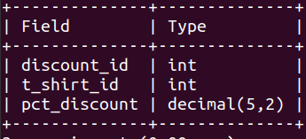
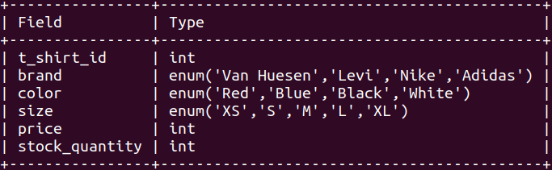
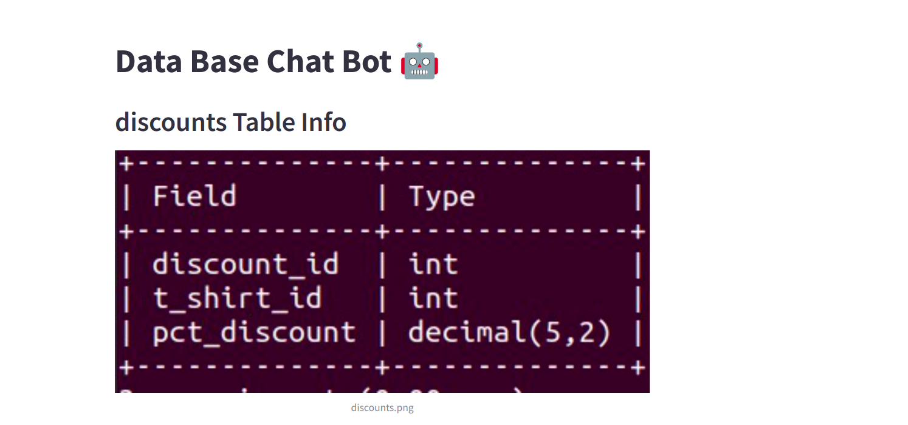
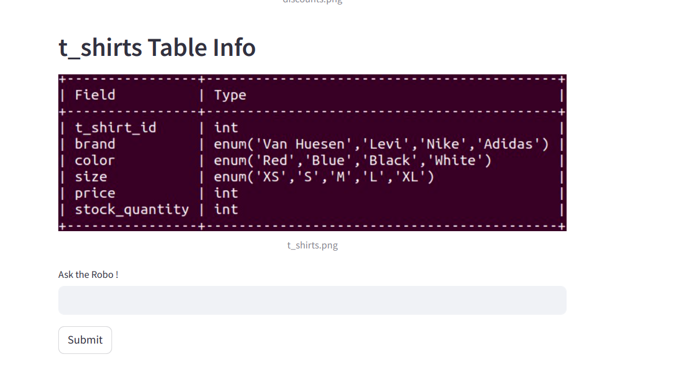
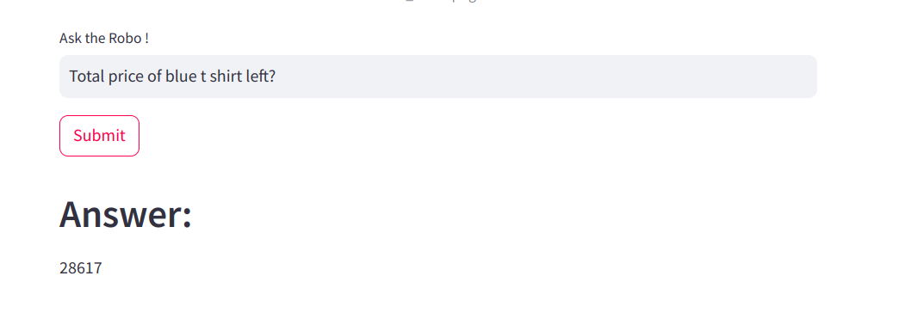

<h1 align="center"> Data Base Chat Bot</h1>

 

 

<h2> :floppy_disk: Table of Content</h2>

 
  * [Introduction](#Introduction)
  * [Problem Statement](#Problem-Statement)
  * [Data Summary](#Data-Summary)
  * [Tools Used](#Data-Summary)
  * [Application UI](#Data-Summary)

<h2> 📄 Introduction</h2>
A chatbot (originally a chatterbot) is a software application or web interface designed to mimic human conversation through text or voice interactions. In this project, I have built a chatbot to help people who don't know much about SQL but want to retrieve Information
from the database

<h2> :book: Data Summary </h2>
- We are using MySQL database which has two tables

* **discounts**:  
  
 
* **t_shirts**: 
  

  

<h2> 📑 Tools Used </h2>

1. Mysql

2. Langchain
   
3. Google Palm (LLM)

4. VS Code

5. Python

6. Huggingface embeddings

<h2>🛠️ Application UI </h2>
 

 

<!-- CREDITS -->
<h2 id="credits"> :scroll: Credits</h2>

MUHLIS CM | Data Scientist | Machine Learning Engineer 

 <i> Contact me for Data Science Project Collaborations</i>

