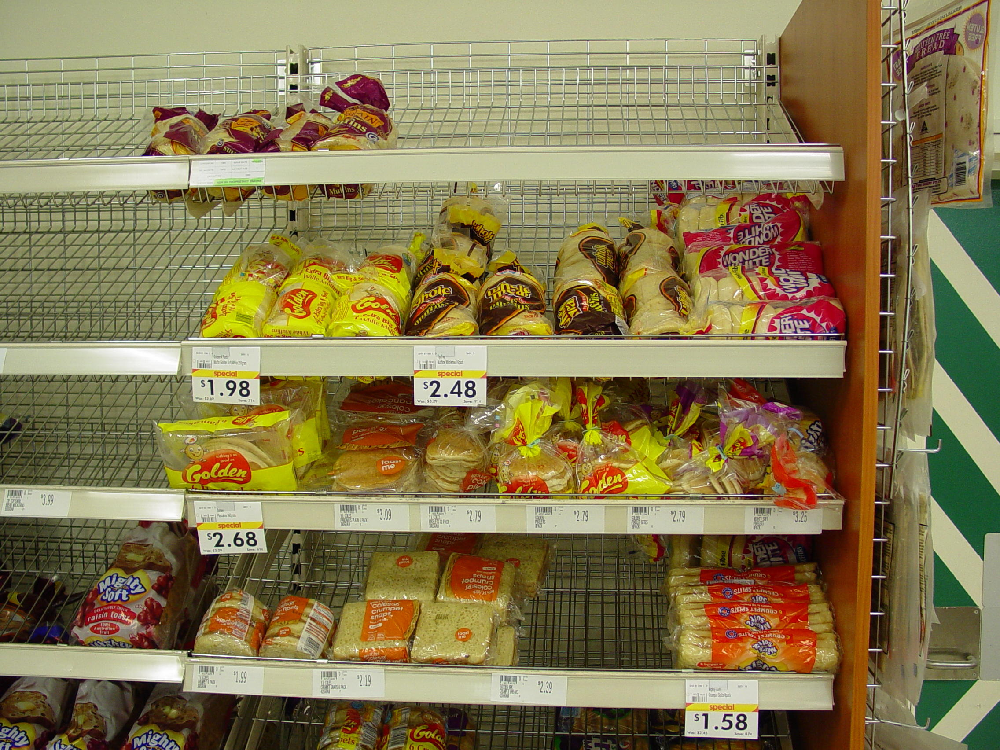
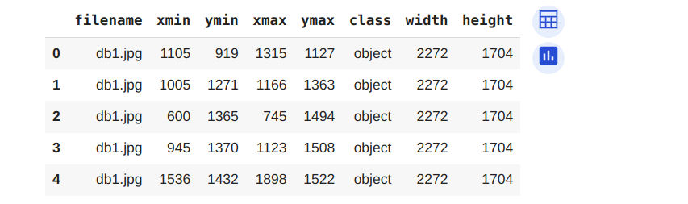

<h1 align="center"> Object Detection On Web Market Data</h1>

 

 

<h2> :floppy_disk: Table of Content</h2>

  * [Problem Statement](#Problem-Statement)
  * [Data Summary](#Data-Summary)
  * [Steps Involved](#Steps-Involved)
  * [Pre-processing](#Pre-processing)
  * [Algorithms used](#Algorithms-used)
  * [Conclusion](#Conclusion)

<h2> ❓ Problem Statement</h2>

Detect grocey objects placed in a shelf using object detection techniques

<h2> :book: Data Summary </h2>

The training data contained 300 images and a CSV contains image properties 

The csv contains the following information:

* filename
* xmin
* ymin
* xmax
* ymax
* class
* width
* height

<h2> 📑 Steps involved </h2>

1. Exploring the data: Analyzing the features and target variable
2. Preparing data for yolo format
3. Train test split
4. Train yolo v8 model

<h2>🛠️ Pre-processing </h2>

### Given Data Format

### Prepared Data In Yolo Format
[Prepared Data](db1.txt)

### Testing Bounding Box

<h2>Getting Started</h2>

1.[RawData](https://www.kaggle.com/datasets/manikchitralwar/webmarket-dataset?rvi=1)  
2.[Data Preparation Script](https://github.com/Muhliscm/dsProjects/blob/main/object_detection_webmarket_data/data_set_creation.ipynb) 
3.[model building scripts](https://github.com/Muhliscm/dsProjects/blob/main/object_detection_webmarket_data/Model_building.ipynb) 

<h2>💻 Algorithms used</h2>

* Yolo V8

<h2> :bulb: Conclusion</h2>

This project help to detect object in a shelf

 

<!-- CREDITS -->
<h2 id="credits"> :scroll: Credits</h2>

MUHLIS CM | Data Scientist | Machine Learning Engineer 

 <i> Contact me for Data Science Project Collaborations</i>

